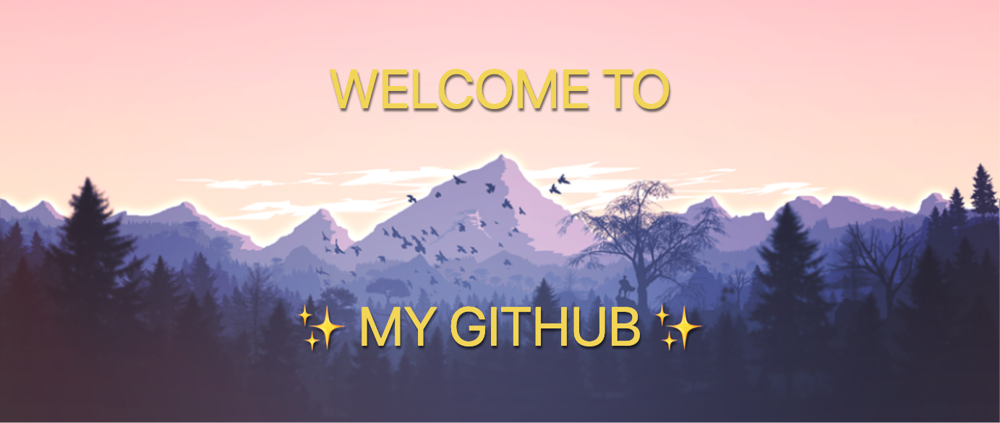

<br>
<div align="center">
<h1> Hi there, I'm Gise 👋</h1>

</div>

<br>
<div align="center">

</div>

<div align="center">
  
### Software Engineer • Full-stack dev • AI-powered solutions 🚀

[](https://linkedin.com/in/giselascarpin)
[](https://giselars.github.io/webportfolio/)
[](mailto:gisela.contactme@gmail.com)

</div>

---

## 👨‍💻 About Me

> I'm a **software engineer & full-stack developer** focused on building modern, scalable applications. I specialize in integrating **AI tools and automation** to create smarter, more efficient user experiences.

```javascript
const gise = {
  location: "Spain 🇪🇸",
  languages: ["Spanish (Native)", "English (Basic - improving!)"],
  currentFocus: ["Building clean, user-friendly web applications"],
  stack: {
    frontend: ["React", "Vue", "TypeScript"],
    backend: ["Node.js", "PHP", "Python"],
    cms: ["WordPress"],
    aiAndAutomation: ["AI Tools", "AI/ML", "Automation", "n8n"],
  },
  interests: ["Web Development", "UI/UX", "AI Integration", "Automation"],
};
```

- 💻 I design and develop tailor-made digital solutions
- 🤖 Exploring **AI tools** and how to integrate them into web apps
- 📊 I enjoy building **landing pages, dashboards and web apps**
- 🌍 Open to **remote collaboration** (working on my English!)
- 📚 Continuous learner, always improving my craft
- 🤝 Available for **freelance projects** and collaborations

---

## 🛠️ Tech Stack

### Full-Stack Development

<div align="center">


</div>

### Tools & Workflow

<div align="center">


</div>

### Currently Learning & Exploring

<div align="center">


</div>

> 💡 **Core focus:** Full-stack development & AI integration  
> 🎯 **Currently expanding into:** AI platforms (GPT, Claude, Gemini, etc.), n8n automation, and intelligent workflows  
> 🤝 **Committed to:** Providing the best solutions for my clients

---

## 🚀 What I Build

<table>
  <tr>
    <td width="50%">
      <h3 align="center">🎨 Landing Pages</h3>
      <p align="center">Responsive, modern landing pages for products and services with attention to design details and user experience</p>
    </td>
    <td width="50%">
      <h3 align="center">📊 Dashboards</h3>
      <p align="center">Interactive dashboards for data visualization with charts, metrics, and real-time updates</p>
    </td>
  </tr>
  <tr>
    <td width="50%">
      <h3 align="center">⚡ Single-Page Apps</h3>
      <p align="center">Dynamic SPAs with API integration, state management, and smooth user interactions</p>
    </td>
    <td width="50%">
      <h3 align="center">🤖 AI-Powered Apps</h3>
      <p align="center">Exploring web applications enhanced with AI features like chatbots, content generation, and smart automation</p>
    </td>
  </tr>
</table>

---

## 📊 GitHub Stats

<div align="center">


</div>

<div align="center" style="display: flex; justify-content: center; gap: 10px;">

<a href="https://github.com/giselars">
    
  </a>

  <a href="https://github.com/giselars">
    
  </a>

</div>

---

## 🌐 Languages

- **🇪🇸 Spanish:** Native
- **🇬🇧 English:** Basic level (currently improving)

_I'm comfortable with technical documentation in English and can communicate for work purposes. Always eager to improve!_

---

## 📫 Let's Connect!

I'm always open to interesting conversations and collaboration opportunities!

<div align="center">

[](https://linkedin.com/in/giselascaripin)
[](mailto:gisela.contactme@gmail.com)
[](https://www.workana.com/freelancer/80229d2680ad76e26b08c898b31a40a0)
[](https://giselars.github.io/webportfolio/)

</div>

---

<div align="center">
  
### 💼 Open for freelance projects and remote opportunities

_"Building the web with modern tools and AI ✨"_


</div>
